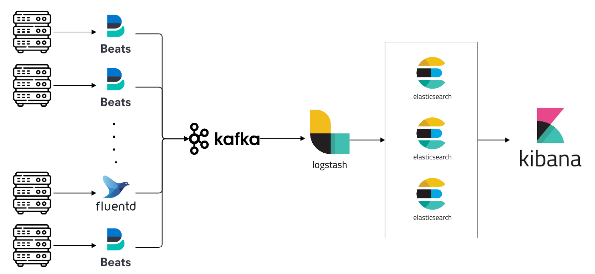

# Log pipeline playground w/ ELK

Log pipeline system example w/ ELK stack

---

Filebeats -> Kibana -> Logstash -> Elastic Search -> Kibana

- Elastic Search 3대 클러스터 구성
- Filebeats, fluentd 등의 로그수집기 대응
- Kafka 연동
- Ansible을 이용한 외부 VM 구성

---

## Test

- producer -> kafka -> logstash -> elastic search -> kibana

